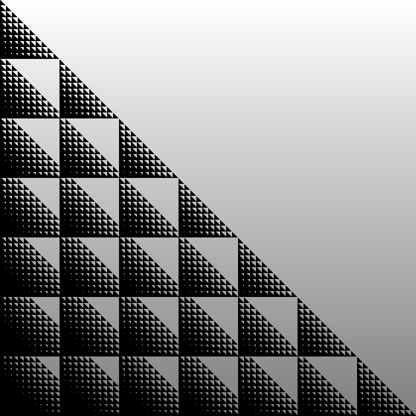

Задание #1
==========

Написать функцию, строящую дерево по списку пар `id` (`id` родителя, `id` потомка),
где `None` - `id` корневого узла.

Пример работы:

.. code:: python

	source = [
		(None, 'a'),
		(None, 'b'),
		(None, 'c'),
		('a', 'a1'),
		('a', 'a2'),
		('a2', 'a21'),
		('a2', 'a22'),
		('b', 'b1'),
		('b1', 'b11'),
		('b11', 'b111'),
		('b', 'b2'),
		('c', 'c1'),
	]

	expected = {
		'a': {'a1': {}, 'a2': {'a21': {}, 'a22': {}}},
		'b': {'b1': {'b11': {'b111': {}}}, 'b2': {}},
		'c': {'c1': {}},
	}

	assert to_tree(source) == expected

Комментарии
-----------

Реализация:
	* `gak1.py` -- в реализации учтена возможность возникновения бесконечного цикла

Задание #2
==========

На бесконечной координатной сетке находится муравей. Муравей может перемещаться на 1 клетку вверх
(x,y+1), вниз (x,y-1), влево (x-1,y), вправо (x+1,y), по одной клетке за шаг.

Клетки, в которых сумма цифр в координате X плюс сумма цифр в координате Y больше чем 25 недоступны муравью.
Например, клетка с координатами (59, 79) недоступна, т.к. 5+9+7+9=30, что больше 25.

Сколько клеток может посетить муравей, если его начальная позиция (1000,1000), (включая начальную клетку)?

Комментарии
-----------

Реализация:
	* `ant1.py` -- первый алгоритм
	* `ant2.py` -- второй алгоритм, быстрее первого в ~20 раз

:Результат: 148848 клеток

